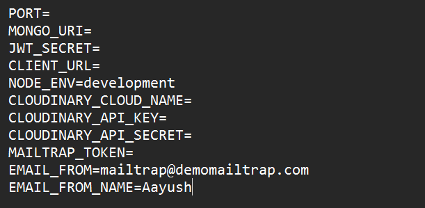

# 🚀 LinkedIn Clone

Welcome to the **LinkedIn Clone** project! This application mimics the core functionalities of LinkedIn, including user profiles, connections, posts, likes, comments, and more. Follow the steps below to set up the project locally and get started.

## 📋 Prerequisites

Make sure you have the following installed:

- **Node.js** (v14 or above)
- **Git**

## 🛠️ Installation Guide

### Step 1: Clone the Repository

First, clone the repository from GitHub by running the following command:

```bash
git clone https://github.com/AayushKP/LinkedIn-Clone.git
```

### Step 2: Navigate to the Project Folder

Move into the client directory and write these commands :

```bash
cd client
npm install
npm run dev
```

### Step 3: Repeat the same step 2 and 3 for server directory

### Step 4: Set Up Environment Variables

Before starting the project, you need to create a .env file in the server directory. This file will hold your environment variables.

Refer to the structure of the .env file in the image below 👇:

## Sample.env



### Step 5: Start the Project

```bash
cd client
npm run dev

cd server
npm run dev
```

🚀 You're All Set!
Your LinkedIn Clone should now be running locally! Open your browser and go to http://localhost:5173 to access the application.

